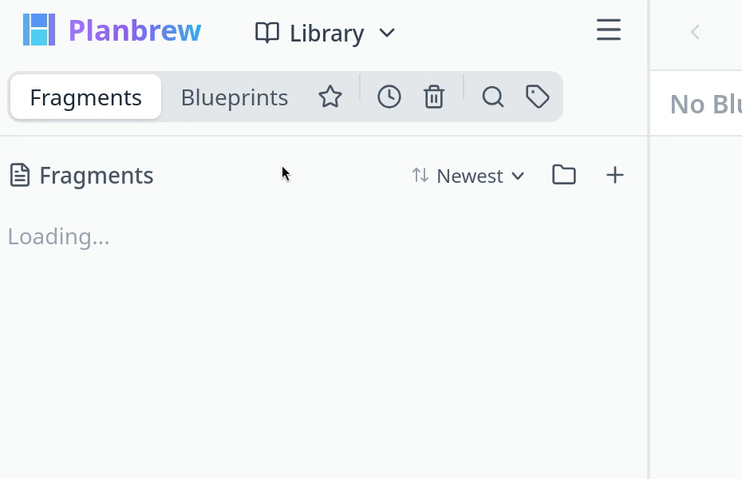
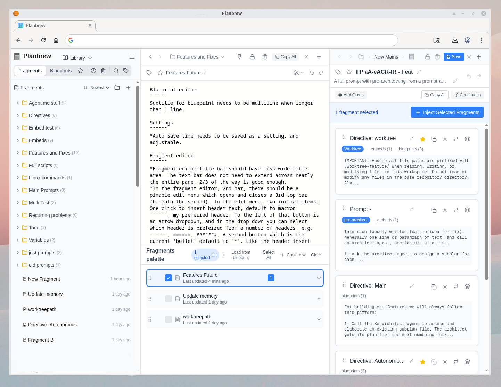

# PlanBrew 1.0.1

**Composable Text Templating**

*Standalone (Offline) Version*

---

<table>
<tr>
<td align="center" valign="top">

  Live app:   https://github.com/wmelabs/planbrew-standalone
</td>
<td align="center" valign="top">

 <strong>PlanBrew</strong>
</td>
</tr>
</table>

PlanBrew is a text editing system built around composable **fragments** (pieces of text) and **blueprints** (templates that combine fragments to generate final output).

PlanBrew can be used to edit prompts for agentic AI routines, posts on social media, or for any task where keeping track of composable text pieces is paramount.

## Standalone Mode

Standalone mode is a fully self-contained single HTML file with only one external dependency: **Monaco Editor**, loaded from CDN for the text editing experience. 

No server is required to run PlanBrew standalone — it runs entirely in the browser using IndexedDB for local storage.

PlanBrew will be open sourced in the near future. 
